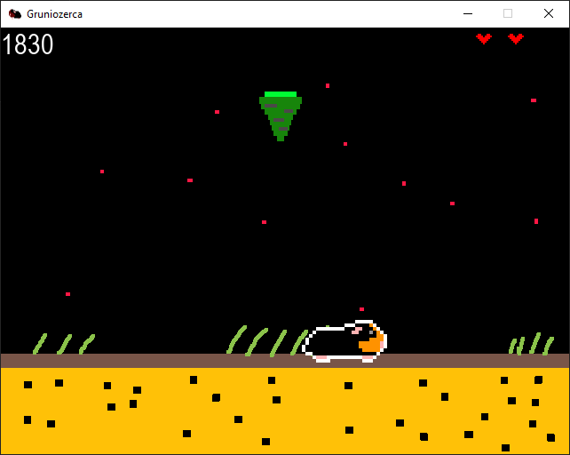

# Gruniozerca
This is a Gruniozerca clone written in Python.

### About
-------------
The original game can be found here: https://github.com/arhneu/gruniozerca 
Control Grunio and collect yummy carrots to fill his infinite tummy!  
Use number keys from 1 to 6 to change Grunio's color.  

### Getting Started
-------------
To compile this project, you will need at least Python 3.9.  
You will also need pygame. You can install it with pip: pip install pygame. 
You're free to modify the project as you wish.

### Preview
-------------

